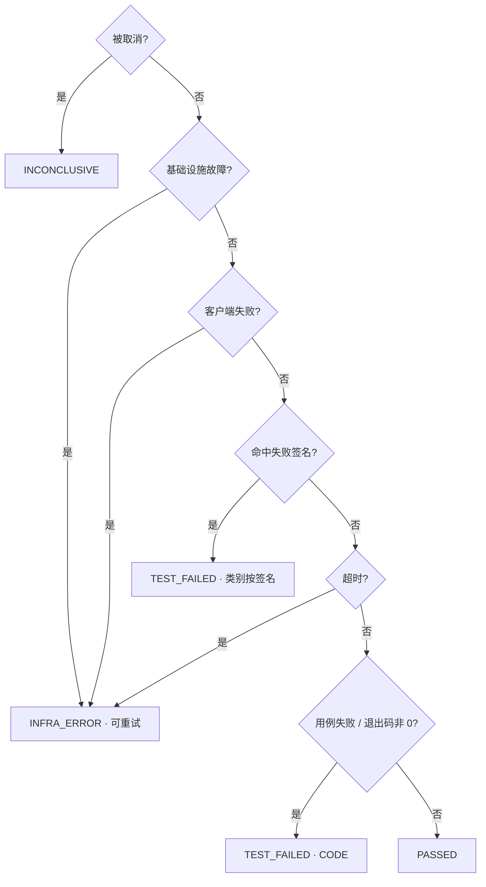

# 让开发板自己跑测试：三个反直觉的设计决定

你有没有经历过这样一个晚上：为了修算法代码里的一处边界条件，先在本地重新编译，再把生成的包倒腾到那台常年插着开发板的 Windows 机器上，插好 USB 线刷板，守在终端前面等脚本跑完，最后一行一行翻 logcat，在几千行输出里找那句被淹没的关键报错。

如果手头只有一两块板子，事情还会更麻烦。隔壁工位的同事也要用它验证自己那条分支，大家在群里排队，谁先抢到谁先跑，跑完记得把现场清干净留给下一个人。最怕的还是那句经典对话——"我这边跑是好的啊"，而问题往往就藏在"我这边"这三个字里：没人能保证他刷的包、他连的板子、他当时的环境，和你现在遇到的是同一件事。

这条从改一行代码到看到真实结果的链路，我们摸索了很久，现在把它整条自动化了。

## 一次 push 会发生什么


故事从一次 `git push` 开始。GitLab CI 会把同一份代码编译成 8 个变体——SNPE 1.68、SNPE 2.21、RKNN、TFLite 各自的 aarch64 Linux/Android 版本都跑一遍。产物打包之前，会先往包里塞进一份描述文件：这个包该部署到设备的哪个目录、启动哪个脚本、传哪些参数、超时多久、怎样算成功、跑完之后要收集哪些文件。打包完成后，产物连同这份描述文件、一份校验和清单一起，上传到 GitLab 的包仓库，文件名里带着提交号和流水线编号。

Trigger 服务收到 GitLab 发来的通知后醒来，把这次 push 对应的全部构建产物拉下来，核对是否齐全、校验和是否匹配，然后启动一个工作流实例。

工作流做的第一件事是去"抢"一块空闲的开发板——如果目标板子正被别的测试占着，就排队等，绝不会有两个任务同时抢占同一块板。抢到之后，工作流把任务连同产物地址一起派给跑在 Windows 机器上的 Client Agent。Client Agent 通过 USB 连接着若干块开发板，它把测试包下载下来、核对校验和、用 ADB 推到板子上、按描述文件里写好的方式启动测试。

测试在真机上跑完后，日志、结果文件、性能数据被收集回来，连同一份执行摘要一起传回工作流。工作流据此判定这一次到底是通过还是失败，把结论连同关键日志的链接一起发到飞书群里，板子随即被释放，等着接下一个任务。

从第一次 push 到飞书群里弹出通知，中间没有人手工点过一次鼠标，也没有人敲过一条 ADB 命令，板子该给谁用、给多久，全部按顺序自动排开。

## 决定一：设备上跑什么，打包那一刻就定死了

Client Agent 连着板子，能摸到设备当时的真实状态：存储还剩多少、是不是 QCM6125、ADB 通不通。真正拿到"运行时信息"的明明是它，那为什么偏偏在打包的那一刻，就把设备上要执行的命令、参数、超时全部写死，Agent 只能照做，不能自己判断？

最直觉的做法至少有三种。第一种，把执行逻辑放在 Agent 侧：Agent 认得每个变体，自己拼命令。第二种，调度端下发命令：工作流知道这次测的是哪个变体，临时组装一条 shell 指令发过去。第三种更省事：让 LLM 临场生成 ADB 命令——反正它看得懂日志、也看得懂变体名字，缺什么补一句就行。

这三种做法有一个共同前提：执行方式能被"认出来"，认出变体名字就能推出该怎么跑。但把 8 个变体摊开看，它们在至少三个维度上互不相同：

| 变体 | 设备要求（requirements） | 环境变量（env） | 失败签名 |
|---|---|---|---|
| SNPE 1.68 / 2.21 (Android) | `soc: [QCM6125]`，`capabilities: [hexagon]` | `LD_LIBRARY_PATH` + `ADSP_LIBRARY_PATH` | `cpu_fallback`(MODEL)、`dsp_unavailable`(DELEGATE) |
| RKNN 2.3.2 (Android) | `soc: [RK3588, RK3566]`，`capabilities: [rknpu]` | 仅 `LD_LIBRARY_PATH` | `rknn_init_fail`(DELEGATE) |
| TFLite 2.21.0 (Android) | 无 `soc`、无 `capabilities`，只有 `abi` 和最低存储 | 仅 `LD_LIBRARY_PATH` | `delegate_fallback`(DELEGATE) |

SNPE 1.68 和 SNPE 2.21 这两个变体，`env` 两行完全相同，一个字符都没差——版本号根本不进这层判断。把执行方式挂在 Agent 侧，等于让 Agent 自己记住"哪些维度相关、哪些无关"这种隐性规则，Agent 升级一次就可能把某个变体判错，而且错得静默：不报错、不崩溃，等下次真出问题才会被怀疑到。

三维差异表说明"怎么跑"因变体而异，更戳心的是"怎么判"也一样因变体而异。同一句日志文本 `"Falling back to CPU"`，在 SNPE 变体里命中签名 `cpu_fallback`，归类 MODEL（模型本身的问题）；在 TFLite 变体里命中的却是 `delegate_fallback`，归类 DELEGATE（推理委派层的问题）。文本一样，归因不同——说明这句日志怎么理解，根本不是执行方能就地推断的，必须由知道这个变体全部背景的一方提前声明。

比错判更麻烦的是没法审计。如果命令是运行时临时拼出来的，三个月后想查"当时那次到底跑的是什么命令"，答案可能已经不在任何地方——调度端日志早已轮转，Agent 也不会保留一次性拼接的中间结果。

我们的做法是把"怎么跑"提前到打包时钉死。CI 按 `ci/variants.yaml` 这张表，把每个变体的部署方式、环境变量、签名规则渲染进 `manifest.yaml`，塞进产物包。这张表既喂打包端，也喂 Agent 侧判定逻辑，两边同一份数据源，不会"打包时以为这样、执行时理解那样"。节选大致长这样：

```yaml
deploy:
  env:
    LD_LIBRARY_PATH: "{workdir}/lib"
    ADSP_LIBRARY_PATH: "{workdir}/lib/dsp;/system/lib/rfsa/adsp"
test:
  entry: ./run.sh
  timeout_sec: 900
  success: { exit_code: 0, require_files: [results/result.json] }
  failure_signatures:
    - { id: cpu_fallback, where: stdout, pattern: "Falling back to CPU", classify: MODEL }
```

`where: stdout` 本身就是一条只能靠实机跑出来的知识：这套 SDK 的测试二进制把日志打在标准输出里，不进 Android logcat，扫描位置得指定成 `stdout`，扫 `logcat` 永远命中不到（`native_crash` 是例外，系统 tombstone 确实落在 logcat 里）。这种"实测出来才知道"的细节，恰恰最需要固化进契约、不能指望执行方临场猜对——这一点在决定三还会再遇到。

Manifest 里还有一层校验容易被忽略：整包有一个 sha256，`files` 列表里逐个文件还各自带一个 sha256。整包校验和只证明"下载没有损坏"，证明不了"manifest 声明的和包里实际二进制是否对得上"——这要靠逐文件校验和保证。

落到 Agent 一侧，代码里能看到的是一组模板化函数，而不是一个通用入口：

```go
func GetProp(serial, prop string) []string
func Push(serial, local, remote string) []string
func ShellChmod(serial, mode, path string) []string
```

这个包里**没有** `Exec(cmd string)` 这样的函数。想在设备上做点什么，得先有一个模板函数对应——没有模板，就做不了。

说到底，这个决定是把"做什么"和"谁来做"拆开：让"做什么"跟着产物包走，而不是跟着执行它的角色走。产物走到哪，规则就跟到哪，谁执行都一样。

> 想细看：`ci/variants.yaml`、`ci/gen_manifest.py`、`agent/internal/manifest/manifest.go`、`agent/internal/adb/adb.go`

## 决定二：判成败的代码只有 89 行，且绝不问 LLM

都已经把 LLM 接进整条链路了，判一次测试到底算过还是不算过，这么简单的事，为什么反而专门写了一段枯燥的 if-else，还刻意不让 LLM 插手？

先说清楚两个概念，全文都不翻译。"跑完了没有"是 status——只描述生命周期走到哪一步：排队、下发、运行、超时、完成。"这次算不算通过"是 verdict——是对结果的最终判定：通过、测试失败、性能回归、基础设施错误、无法判定。同样是 TIMEOUT 这个 status，如果日志里命中了失败签名（比如 `cpu_fallback`），会被更靠前的分支拦下，判成 TEST_FAILED、归到 MODEL 类；没命中任何签名，才会落到 TIMEOUT 分支，判成 INFRA_ERROR、允许重试——这才是同一个 status 对应不同 verdict 的真实例子（为什么签名分支排在超时前面，后文再展开）。一旦把两者揉进同一个字段，将来就再也拆不开：决定一里的签名分类之所以能生效，前提正是 verdict 里留得下"归到哪一类错误"这个信息，不能被 status 占掉。

第二个概念是 Temporal，跑这整条流程的引擎，可以类比成一个"能断点续跑的脚本引擎"：流程跑到一半进程被杀、机器重启，它不会从头再来，而是把此前每一步事件重放一遍，快速回到断点继续跑。这意味着流程代码里的每一步都可能被反复执行——前几遍只是重放，读历史记录，不会真的重新调一次外部服务。

第一条理由：verdict 必须可复现、可回放。将来要拿它做分支合并门禁，三个月后有人问"这次为什么判失败"，答案不能是"当时问过一次，具体为什么已说不清"——裁决必须是一段重新算一遍也不变结果的逻辑。

第二条理由，也是本节真正的精妙处：判定函数 `Decide` 是纯函数——不读数据库、不发网络请求、不看时钟，只按传入字段算结果。正因为它没有任何 I/O，才被刻意留在流程代码里直接调用，而非像其他步骤一样包成独立调用；重放时这段代码会重跑一遍，输入一样，算出的 verdict 必然一样。这不是漏掉了一层封装图省事，而是特意利用"纯函数等于可安全重放"这个前提做的选择。

以上两条回答的是"规则引擎该长什么样、放在哪"；要不要让 LLM 来裁决，是另一个问题。LLM 在这里第一次正式出场——以"我们决定不让它做什么"的身份登场。它不参与裁决，原因不是调用 LLM 会打乱重放：那次调用只要包成独立一步、结果记进历史，重放时一样只读记录不重新问它，这条路径本身没问题。真正的原因是另外两条：一是 verdict 要经得起三个月后的审计复现，同一个问题问 LLM 两次未必答案一致；二是 LLM 会挂、会超时、会被限流，而已经开始的任务必须能收敛到终态，不能因为一次调用没等到响应就一直悬着。



链路里核心的四步是：

```go
if in.Status == "CANCELED" { return ...VerdictInconclusive... }
if in.InfraReason != "" {   return ...VerdictInfraError, Retry: true... }
// (还有一支 client-side FAILED 判断，此处从略)
if len(in.SignaturesHit) > 0 {
    sig := in.SignaturesHit[0]          // 按 Manifest 声明序，首个命中定类别
    return Decision{Verdict: VerdictTestFailed, Category: in.SignatureCategory[sig]}
}
if in.Status == "TIMEOUT" { return ...VerdictInfraError, Retry: true... }
```

真正做判断的 `Decide` 函数一共 36 行，加上类型定义和包注释，整个文件看着有 89 行，够不上"复杂"两个字。

顺序也不是随手排的：签名携带的信息量远比"超时了"这种笼统结论具体，理应优先采信。反过来先判超时，前面 `cpu_fallback` 那个例子就会被草率记成"基础设施超时"，白白丢掉日志里已写明的真实原因。

LLM 真正待的地方，是末端一个独立服务 `analyze_bridge`：调用时固定给空工具集，它没有任何工具能力；返回内容必须过 JSON Schema 校验，不过就把校验错误附回提示词重试，最多三次；仍不过或调用本身失败，一律当作这次分析没做，流程照常往下走，verdict 依旧由规则引擎给出。

让 LLM 解释，不让 LLM 裁决。

> 想细看：`runtime/internal/rules/rules.go`、`runtime/internal/workflow/devicetest.go`、`hermes/analyze_bridge/`

## 决定三：先写一个"注定被扔掉"的命令行工具

明知道最终要交付的是一个跑在 Windows 上的常驻服务——接受调度、维护心跳、管理设备队列，为什么第一步却是先写一个用完就该扔掉的命令行工具?

答案跟"应该做成什么"没有关系，跟"这条链路上哪一段最不确定"有关系。Temporal 的重试语义、回调的幂等键、心跳续租，这些都是纯逻辑问题，在服务端就能想清楚、写清楚、测清楚。真正会反复踩坑的是另一段：Windows 机器上驱动装没装对、USB 口认不认设备、开发板的序列号会不会重启就丢、adb server 抢没抢占同一个端口、命令行输出经过终端编码转一手会不会乱码。这些坑跟 Temporal、跟回调、跟幂等键毫无关系，纯粹是"接上一块设备"这一层的具体麻烦。

如果先把服务壳搭起来——HTTP handler、任务队列、心跳线程，每调一个 ADB 问题，都得先穿过这五层抽象才能看到设备侧到底发生了什么。命令行工具反过来：一行 `agent-cli run --package-url ... --serial ...`，参数摆在眼前，输出直接打在终端，改一行代码、重跑一次的成本以秒计。决定一里提过一句"Android 扫 stdout 而不是 logcat"的知识，正是在这个阶段用 CLI 一次次实跑试出来的：先怀疑签名规则写错了，再怀疑设备权限不够，最后才发现测试二进制根本没往 logcat 里打日志，日志走的是标准输出。这种知识没有捷径可抄，只能靠跑，而命令行工具让"跑一次"这件事便宜到可以反复试错。

但这不代表命令行工具真的会被扔掉。回头看 `agent/internal/executor` 这个包，从下载、校验、解压、预检、部署、执行到收集，整条流水线原封不动地被服务模式复用——写服务模式的时候没有重新实现一遍这条链路，接缝只是一个 `OnTransition` 钩子：

```go
// agent-cli：不关心状态迁移要通知谁
exec := &executor.Executor{Runner: ..., Logf: logf}

// 服务模式：同一个 executor，把迁移接到事件上报链上
exec := s.newExecutor()
exec.OnTransition = func(to executor.Status) {
    s.cfg.Events.OnTransition(d.TaskID, s.currentStatus(d.TaskID), to, "")
}
```

命令行工具不关心状态迁移通知给谁，日志打到 stderr 就算交差；服务模式构造同一个 `executor.Executor`，只多接一根线，把迁移转发到事件上报链路。原封不动长进服务里的，是这条 executor 流水线本身。

命令行工具还留了一处独立设计，但没被服务模式复用——退出码。服务模式是常驻进程，没有"退出码"这回事：任务终态靠 `result.json` 的 `status`/`exit_code`（设备侧测试进程自己的退出码，跟下面 0/1/2/3 是两码事）经回调上报。agent-cli 跑一次就退出，只能靠整数带出结果，`main` 收尾是一段 switch：

```go
switch sum.Status {
case executor.StatusCompleted:
    if sum.SuccessCriteriaMet { return 0 }
    return 2                    // 测试没过
case executor.StatusTimeout:
    return 3
default:
    return 1                    // 流水线自己坏了
}
```

2 和 1 刻意分开——"测试没过"和"流水线自己坏了"是两回事，不能都不是 0 就混为一谈。这是决定二 status/verdict 正交思路，在命令行层的又一次独立落地：跑没跑完是一回事，跑完算不算通过是另一回事，两者不能塌缩成一个数字。

其余细节同样朴素：`--serial` 必填，不填直接报错，文案写着"禁止无 -s 的 adb 操作"——接不止一块板时，不带 `-s` 的 adb 命令落哪块设备说不准。执行超时会被 kill，日志仍照常收集，超时往往最需要看现场。ADB server 端口固定用私有 5137，不碰系统默认 5037，免得跟开发者调试的 adb server 抢设备。

先攻不确定性最高的那一段，用最薄的壳。

> 想细看：`agent/cmd/agent-cli/main.go`、`agent/internal/executor/executor.go`

## 这些决定值不值

三个决定不是纸面推演，路上真踩过对应的坑。

| 踩坑 | 印证 |
|---|---|
| GitLab 13.8 的 Generic Registry 版本号强制 strict `X.Y.Z`，版本号不变时新构建被 already-exists 静默 skip 掉 | 契约优先——唯一性必须编进文件名，不能指望版本号兜底 |
| 固件报的 SoC 代号是 `trinket`，调度约束写的却是型号 `QCM6125`，派单成功、预检才发现两边对不上 | agent-cli 先行——这坑在命令行阶段就暴露了，没有拖到服务上线才发现 |
| Docker 默认网段撞上内网真实设备 | 确定性优先于便利——不能让"自动分配"这种图省事的默认值,决定一条真实链路通不通 |

也得说一句公道话：规则引擎目前还没有版本号，将来改判定规则会破坏历史工作流的重放一致性——这是已经识别、已经排期的整改项。写出来是因为，一个能说清自己缺口在哪的设计，比一个看起来没有缺口的设计更可信。

数字比论证更有说服力。Phase 1 的 DoD 已经达成：push 一次代码，CI 编译、Trigger 派单、开发板实测、结果回收、飞书通知全自动跑完，SNPE 1.68、SNPE 2.21、TFLite 三个变体全部 PASSED，真机推理耗时分别是 6.9s、5.7s、9.2s——个位数秒级，全程无人工干预、零重复执行。

回头看这三个决定，说的其实是同一件事：让"做什么"跟着产物走，而不是跟着执行者走；让 LLM 解释，不让 LLM 裁决；先攻不确定性最高的那一段，用最薄的壳。三句话背后是一个共同的判断——把不确定的东西挡在确定的东西外面。
