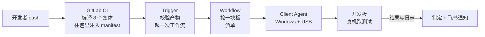

# 让开发板自己跑测试：三个反直觉的设计决定

你有没有经历过这样一个晚上：为了修算法代码里的一处边界条件，先在本地重新编译，再把生成的包倒腾到那台常年插着开发板的 Windows 机器上，插好 USB 线刷板，守在终端前面等脚本跑完，最后一行一行翻 logcat，在几千行输出里找那句被淹没的关键报错。

如果手头只有一两块板子，事情还会更麻烦。隔壁工位的同事也要用它验证自己那条分支，大家在群里排队，谁先抢到谁先跑，跑完记得把现场清干净留给下一个人。最怕的还是那句经典对话——"我这边跑是好的啊"，而问题往往就藏在"我这边"这三个字里：没人能保证他刷的包、他连的板子、他当时的环境，和你现在遇到的是同一件事。

这条从改一行代码到看到真实结果的链路，我们摸索了很久，现在把它整条自动化了。

## 一次 push 会发生什么

故事从一次 `git push` 开始。GitLab CI 会把同一份代码编译成 8 个变体——SNPE 1.68、SNPE 2.21、RKNN、TFLite 各自的 aarch64 Linux/Android 版本都跑一遍。产物打包之前，会先往包里塞进一份描述文件：这个包该部署到设备的哪个目录、启动哪个脚本、传哪些参数、超时多久、怎样算成功、跑完之后要收集哪些文件。打包完成后，产物连同这份描述文件、一份校验和清单一起，上传到 GitLab 的包仓库，文件名里带着提交号和流水线编号。

Trigger 服务收到 GitLab 发来的通知后醒来，把这次 push 对应的全部构建产物拉下来，核对是否齐全、校验和是否匹配，然后启动一个工作流实例。

工作流做的第一件事是去"抢"一块空闲的开发板——如果目标板子正被别的测试占着，就排队等，绝不会有两个任务同时抢占同一块板。抢到之后，工作流把任务连同产物地址一起派给跑在 Windows 机器上的 Client Agent。Client Agent 通过 USB 连接着若干块开发板，它把测试包下载下来、核对校验和、用 ADB 推到板子上、按描述文件里写好的方式启动测试。

测试在真机上跑完后，日志、结果文件、性能数据被收集回来，连同一份执行摘要一起传回工作流。工作流据此判定这一次到底是通过还是失败，把结论连同关键日志的链接一起发到飞书群里，板子随即被释放，等着接下一个任务。

从第一次 push 到飞书群里弹出通知，中间没有人手工点过一次鼠标，也没有人敲过一条 ADB 命令，板子该给谁用、给多久，全部按顺序自动排开。

## 决定一：设备上跑什么，打包那一刻就定死了

## 决定二：判成败的代码只有 89 行，且绝不问 LLM

## 决定三：先写一个"注定被扔掉"的命令行工具

## 这些决定值不值
