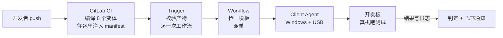

# 让开发板自己跑测试：三个反直觉的设计决定

你有没有经历过这样一个晚上：为了修算法代码里的一处边界条件，先在本地重新编译，再把生成的包倒腾到那台常年插着开发板的 Windows 机器上，插好 USB 线刷板，守在终端前面等脚本跑完，最后一行一行翻 logcat，在几千行输出里找那句被淹没的关键报错。

如果手头只有一两块板子，事情还会更麻烦。隔壁工位的同事也要用它验证自己那条分支，大家在群里排队，谁先抢到谁先跑，跑完记得把现场清干净留给下一个人。最怕的还是那句经典对话——"我这边跑是好的啊"，而问题往往就藏在"我这边"这三个字里：没人能保证他刷的包、他连的板子、他当时的环境，和你现在遇到的是同一件事。

这条从改一行代码到看到真实结果的链路，我们摸索了很久，现在把它整条自动化了。

## 一次 push 会发生什么



故事从一次 `git push` 开始。GitLab CI 会把同一份代码编译成 8 个变体——SNPE 1.68、SNPE 2.21、RKNN、TFLite 各自的 aarch64 Linux/Android 版本都跑一遍。产物打包之前，会先往包里塞进一份描述文件：这个包该部署到设备的哪个目录、启动哪个脚本、传哪些参数、超时多久、怎样算成功、跑完之后要收集哪些文件。打包完成后，产物连同这份描述文件、一份校验和清单一起，上传到 GitLab 的包仓库，文件名里带着提交号和流水线编号。

Trigger 服务收到 GitLab 发来的通知后醒来，把这次 push 对应的全部构建产物拉下来，核对是否齐全、校验和是否匹配，然后启动一个工作流实例。

工作流做的第一件事是去"抢"一块空闲的开发板——如果目标板子正被别的测试占着，就排队等，绝不会有两个任务同时抢占同一块板。抢到之后，工作流把任务连同产物地址一起派给跑在 Windows 机器上的 Client Agent。Client Agent 通过 USB 连接着若干块开发板，它把测试包下载下来、核对校验和、用 ADB 推到板子上、按描述文件里写好的方式启动测试。

测试在真机上跑完后，日志、结果文件、性能数据被收集回来，连同一份执行摘要一起传回工作流。工作流据此判定这一次到底是通过还是失败，把结论连同关键日志的链接一起发到飞书群里，板子随即被释放，等着接下一个任务。

从第一次 push 到飞书群里弹出通知，中间没有人手工点过一次鼠标，也没有人敲过一条 ADB 命令，板子该给谁用、给多久，全部按顺序自动排开。

## 决定一：设备上跑什么，打包那一刻就定死了

Client Agent 连着板子，能摸到设备当时的真实状态：存储还剩多少、是不是 QCM6125、ADB 通不通。真正拿到"运行时信息"的明明是它，那为什么偏偏在打包的那一刻，就把设备上要执行的命令、参数、超时全部写死，Agent 只能照做，不能自己判断？

最直觉的做法至少有三种。第一种，把执行逻辑放在 Agent 侧：Agent 认得每个变体，自己拼命令。第二种，调度端下发命令：工作流知道这次测的是哪个变体，临时组装一条 shell 指令发过去。第三种更省事：让 LLM 临场生成 ADB 命令——反正它看得懂日志、也看得懂变体名字，缺什么补一句就行。

这三种做法有一个共同前提：执行方式能被"认出来"，认出变体名字就能推出该怎么跑。但把 8 个变体摊开看，它们在至少三个维度上互不相同：

| 变体 | 设备要求（requirements） | 环境变量（env） | 失败签名 |
|---|---|---|---|
| SNPE 1.68 / 2.21 (Android) | `soc: [QCM6125]`，`capabilities: [hexagon]` | `LD_LIBRARY_PATH` + `ADSP_LIBRARY_PATH` | `cpu_fallback`(MODEL)、`dsp_unavailable`(DELEGATE) |
| RKNN 2.3.2 (Android) | `soc: [RK3588, RK3566]`，`capabilities: [rknpu]` | 仅 `LD_LIBRARY_PATH` | `rknn_init_fail`(DELEGATE) |
| TFLite 2.21.0 (Android) | 无 `soc`、无 `capabilities`，只有 `abi` 和最低存储 | 仅 `LD_LIBRARY_PATH` | `delegate_fallback`(DELEGATE) |

SNPE 1.68 和 SNPE 2.21 这两个变体，`env` 两行完全相同，一个字符都没差——版本号根本不进这层判断。把执行方式挂在 Agent 侧，等于让 Agent 自己记住"哪些维度相关、哪些无关"这种隐性规则，Agent 升级一次就可能把某个变体判错，而且错得静默：不报错、不崩溃，等下次真出问题才会被怀疑到。

三维差异表说明"怎么跑"因变体而异，更戳心的是"怎么判"也一样因变体而异。同一句日志文本 `"Falling back to CPU"`，在 SNPE 变体里命中签名 `cpu_fallback`，归类 MODEL（模型本身的问题）；在 TFLite 变体里命中的却是 `delegate_fallback`，归类 DELEGATE（推理委派层的问题）。文本一样，归因不同——说明这句日志怎么理解，根本不是执行方能就地推断的，必须由知道这个变体全部背景的一方提前声明。

比错判更麻烦的是没法审计。如果命令是运行时临时拼出来的，三个月后想查"当时那次到底跑的是什么命令"，答案可能已经不在任何地方——调度端日志早已轮转，Agent 也不会保留一次性拼接的中间结果。

我们的做法是把"怎么跑"提前到打包时钉死。CI 按 `ci/variants.yaml` 这张表，把每个变体的部署方式、环境变量、签名规则渲染进 `manifest.yaml`，塞进产物包。这张表既喂打包端，也喂 Agent 侧判定逻辑，两边同一份数据源，不会"打包时以为这样、执行时理解那样"。节选大致长这样：

```yaml
deploy:
  env:
    LD_LIBRARY_PATH: "{workdir}/lib"
    ADSP_LIBRARY_PATH: "{workdir}/lib/dsp;/system/lib/rfsa/adsp"
test:
  entry: ./run.sh
  timeout_sec: 900
  success: { exit_code: 0, require_files: [results/result.json] }
  failure_signatures:
    - { id: cpu_fallback, where: stdout, pattern: "Falling back to CPU", classify: MODEL }
```

`where: stdout` 本身就是一条只能靠实机跑出来的知识：这套 SDK 的测试二进制把日志打在标准输出里，不进 Android logcat，扫描位置得指定成 `stdout`，扫 `logcat` 永远命中不到（`native_crash` 是例外，系统 tombstone 确实落在 logcat 里）。这种"实测出来才知道"的细节，恰恰最需要固化进契约、不能指望执行方临场猜对——这一点在决定三还会再遇到。

Manifest 里还有一层校验容易被忽略：整包有一个 sha256，`files` 列表里逐个文件还各自带一个 sha256。整包校验和只证明"下载没有损坏"，证明不了"manifest 声明的和包里实际二进制是否对得上"——这要靠逐文件校验和保证。

落到 Agent 一侧，代码里能看到的是一组模板化函数，而不是一个通用入口：

```go
func GetProp(serial, prop string) []string
func Push(serial, local, remote string) []string
func ShellChmod(serial, mode, path string) []string
```

这个包里**没有** `Exec(cmd string)` 这样的函数。想在设备上做点什么，得先有一个模板函数对应——没有模板，就做不了。

说到底，这个决定是把"做什么"和"谁来做"拆开：让"做什么"跟着产物包走，而不是跟着执行它的角色走。产物走到哪，规则就跟到哪，谁执行都一样。

> 想细看：`ci/variants.yaml`、`ci/gen_manifest.py`、`agent/internal/manifest/manifest.go`、`agent/internal/adb/adb.go`

## 决定二：判成败的代码只有 89 行，且绝不问 LLM

## 决定三：先写一个"注定被扔掉"的命令行工具

## 这些决定值不值
