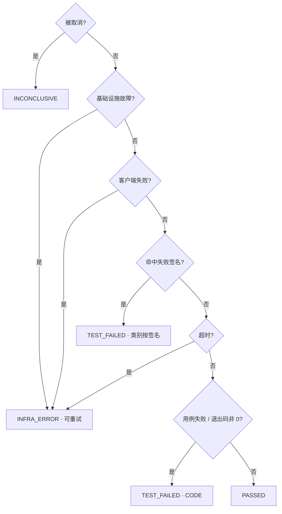

# 博客《让开发板自己跑测试：三个反直觉的设计决定》实施计划

> **For agentic workers:** REQUIRED SUB-SKILL: Use superpowers:subagent-driven-development (recommended) or superpowers:executing-plans to implement this plan task-by-task. Steps use checkbox (`- [ ]`) syntax for tracking.

**Goal:** 产出一篇约 3900 字的内部技术博客，面向嵌入式/算法工程师，用三个独立的设计决策讲清这套开发板自动测试系统的思路。

**Architecture:** 单个 Markdown 文件，六节结构（开篇 → 全景 → 三个决策 → 收束）。每节独立成任务：先回仓库核验该节要引用的全部事实，再写作，再跑验收检查，最后提交。核验先于写作是本计划的核心纪律——设计 spec 阶段已有两处凭印象下笔的事实错误被逐一证伪。

**Tech Stack:** Markdown、mermaid（2 张图）、Go 代码片段（取自本仓库）、pytest/go 无关（本计划不改代码，只读代码取证）。

## Global Constraints

以下为 spec `docs/superpowers/specs/2026-07-24-blog-three-decisions-design.md` 的项目级要求，每个任务都隐含包含：

- **产出路径**：`docs/blog/2026-07-24-three-counterintuitive-decisions.md`（英文 slug 文件名，正文一级标题用中文）
- **正文一级标题**：`# 让开发板自己跑测试：三个反直觉的设计决定`
- **读者设定**：嵌入式/算法工程师。熟悉开发板、ADB、SNPE/RKNN；对 Temporal、workflow 重放、幂等键、契约校验陌生。术语首次出现给一句白话解释。
- **不翻译 status / verdict**，二者区分是全文核心。
- **代码片段全文 ≤5 段，每段 ≤10 行。** 五段已在各任务中指定，不得自行增删。
- **mermaid 图恰好 2 张**：全景流程图（Task 1）、规则引擎优先级链条（Task 3）。
- **可写真名**：`algo-super-sdk`、QCM6125、SNPE 1.68/2.21、GitLab 13.8、飞书、Temporal、MinIO、RK3588/RK3566。
- **禁止出现**：内网域名、凭据配置项名（如 `ARTIFACT_AUTH_TOKEN`、`GITLAB_TOKEN`）、具体 IP 网段（"172.22" 一律改写为"Docker 默认网段"）。
- **开篇 300 字内不得出现** "AI"、"LLM"、"Hermes" 字样。
- **每节末尾一行**：`> 想细看：\`<repo 相对路径>\``
- **事实纪律**：凡出现具体数字、路径、字段名、日志文本，必须由该任务的核验步骤当场从仓库读出，不得凭本计划的转述二次传抄。本计划中给出的所有片段均已于 2026-07-24 核验，但执行时仍须重跑核验命令确认未漂移。

### 五条事实准确性红线（spec §事实准确性红线，逐字遵守）

1. 不得写成"LLM 会破坏 Temporal 重放所以不能用"。Activity 内调用 LLM 是重放安全的，结果固化在 history 中。真实理由是"verdict 必须可审计可复现" + "LLM 不可用时任务必须能收敛"。
2. `rules.Decide` 留在 workflow 内是刻意设计，因其为纯函数、零 I/O，不是图省事。
3. "让 LLM 临场生成 adb 命令"是作为对比虚构的反面做法，写作"最直觉的做法"，不得写成"有人提过"。
4. 规则引擎是 **89 行**，不是 171 行（171 是 `rules.go` 89 行与 `rules_test.go` 82 行的合计）。
5. 不得写"SNPE 1.68 与 2.21 的环境变量不同"——二者 env 完全一致。真实差异在后端框架之间与 OS 之间。

### 字数预算

| 节 | 字数 | 任务 |
|---|---|---|
| 开篇 | 300 | Task 1 |
| 全景速写 | 500 | Task 1 |
| 决定一 | 900 | Task 2 |
| 决定二 | 1000 | Task 3 |
| 决定三 | 800 | Task 4 |
| 收束 | 400 | Task 5 |
| **合计** | **3900** | 验收区间 3500–4300 |

字数指**中文字符数，不含代码块**。统一用 Task 1 定义的 `wordcount.py` 脚本测量。

---

## File Structure

| 文件 | 责任 | 任务 |
|---|---|---|
| `docs/blog/2026-07-24-three-counterintuitive-decisions.md` | 博客全文，唯一产出 | Task 1–6 递增写入 |
| `docs/blog/wordcount.py` | 字数测量工具（排除代码块，统计中文字符） | Task 1 创建 |

本计划不修改任何生产代码，仅从仓库读取事实。

---

## Task 1: 骨架、开篇与全景速写

**Files:**
- Create: `docs/blog/2026-07-24-three-counterintuitive-decisions.md`
- Create: `docs/blog/wordcount.py`
- Read (取证): `README.md`、`docs/superpowers/plans/2026-07-22-agent-service-handoff.md`

**Interfaces:**
- Produces: 博客文件与六级标题骨架，后续任务按标题填入；`wordcount.py` 供 Task 2–6 复用，调用方式 `python3 docs/blog/wordcount.py <file> [起始标题] [结束标题]`

- [ ] **Step 1: 创建字数测量脚本**

```python
#!/usr/bin/env python3
"""统计 Markdown 中文字符数，排除代码块。用法:
    python3 docs/blog/wordcount.py <file.md> [start_heading] [end_heading]
不给标题则统计全文；给了则只统计两个标题之间的区段(不含 end_heading 行)。"""
import re, sys

path = sys.argv[1]
text = open(path, encoding="utf-8").read()
if len(sys.argv) > 2:
    start = text.find(sys.argv[2])
    text = text[start:] if start >= 0 else ""
if len(sys.argv) > 3:
    end = text.find(sys.argv[3])
    text = text[:end] if end >= 0 else text
text = re.sub(r"```.*?```", "", text, flags=re.S)   # 去代码块
text = re.sub(r"`[^`]*`", "", text)                  # 去行内代码
print(len(re.findall(r"[一-鿿]", text)))
```

- [ ] **Step 2: 核验全景速写要引用的事实**

Run:
```bash
cd /home/maxin/Code/hermes_ai_devops
grep -n "Phase 1 DoD 已达成" -A3 README.md
grep -n "SNPE 1.68 \| PASSED" -A3 docs/superpowers/plans/2026-07-22-agent-service-handoff.md
```

Expected: README 显示 DoD 达成于 2026-07-22，workflow ID 为 `device-test-aios/algo_super_sdk-g108e0d72-p46`；handoff 表格显示 SNPE 1.68 / SNPE 2.21 / TFLite 三个变体 PASSED，exit 0，耗时 6.9s / 5.7s / 9.2s，各 4 个附件。

**记下这三个耗时数字，Task 5 收束要用。**

- [ ] **Step 3: 写入文件骨架与全部六级标题**

创建 `docs/blog/2026-07-24-three-counterintuitive-decisions.md`，写入：

```markdown
# 让开发板自己跑测试：三个反直觉的设计决定

<!-- 开篇 -->

## 一次 push 会发生什么

## 决定一：设备上跑什么，打包那一刻就定死了

## 决定二：判成败的代码只有 89 行，且绝不问 LLM

## 决定三：先写一个"注定被扔掉"的命令行工具

## 这些决定值不值
```

后续任务在对应标题下填充，不得改动标题文字（Task 6 的验收检查依赖标题精确匹配）。

- [ ] **Step 4: 写开篇（300 字）**

在 `<!-- 开篇 -->` 处替换为正文。要点：

- 从痛点切入：改一行算法代码，要手工编译 → 拷包到 Windows → 刷板 → 跑脚本 → 翻日志。
- 多人抢一块板；"在我板子上是好的"。
- 结尾一句过渡到"我们把这条链路自动化了"，**不解释架构，不出现 AI / LLM / Hermes**。

硬约束：这 300 字内出现 "AI"、"LLM"、"Hermes" 任一即为不合格（Task 6 会自动检查）。

- [ ] **Step 5: 写全景速写（500 字）与第一张 mermaid 图**

在 `## 一次 push 会发生什么` 下写入。先放图后放散文，图用：

````markdown

````

散文只交代**发生了什么**，不解释为什么（"为什么"是后三节的职责）。明确点出：全程无人工干预，从 push 到收到飞书通知。

- [ ] **Step 6: 核验字数与开篇禁用词**

Run:
```bash
cd /home/maxin/Code/hermes_ai_devops
python3 docs/blog/wordcount.py docs/blog/2026-07-24-three-counterintuitive-decisions.md "# 让开发板" "## 一次 push"
python3 docs/blog/wordcount.py docs/blog/2026-07-24-three-counterintuitive-decisions.md "## 一次 push" "## 决定一"
awk '/^# 让开发板/,/^## 一次 push/' docs/blog/2026-07-24-three-counterintuitive-decisions.md | grep -cE "AI|LLM|Hermes"
```

Expected: 开篇 250–350；全景 420–580；禁用词计数为 `0`。

不达标就改，改到达标再进 Step 7。

- [ ] **Step 7: 提交**

```bash
cd /home/maxin/Code/hermes_ai_devops
git add docs/blog/2026-07-24-three-counterintuitive-decisions.md docs/blog/wordcount.py
git commit -m "docs(blog): opening and system overview"
```

---

## Task 2: 决定一——设备上跑什么，打包那一刻就定死了

**Files:**
- Modify: `docs/blog/2026-07-24-three-counterintuitive-decisions.md`（`## 决定一` 节下）
- Read (取证): `ci/variants.yaml`、`agent/internal/adb/adb.go`、`agent/internal/manifest/manifest.go`

**Interfaces:**
- Consumes: Task 1 的骨架标题与 `wordcount.py`
- Produces: 决定一全节；结尾的"实测得出的签名扫描位置"为 Task 4 的伏笔，Task 4 会回指本节

- [ ] **Step 1: 核验三维差异表的全部数据**

Run:
```bash
cd /home/maxin/Code/hermes_ai_devops
sed -n '33,75p' ci/variants.yaml
```

Expected 逐项确认：
- `aarch64_Android_SNPE_1.68` 与 `aarch64_Android_SNPE_2.21` 的 `env` **两行完全相同**（`LD_LIBRARY_PATH: "{workdir}/lib"` 与 `ADSP_LIBRARY_PATH: "{workdir}/lib/dsp;/system/lib/rfsa/adsp"`）——这是红线 5 的依据，必须亲眼确认。
- SNPE Android 的 requirements 为 `soc: [QCM6125]`、`capabilities: [hexagon]`。
- RKNN Android 的 requirements 为 `soc: [RK3588, RK3566]`、`capabilities: [rknpu]`。
- TFLite Android 的 requirements **无 soc、无 capabilities**，仅 `abi` 与 `min_free_storage_mb`。
- 签名 id：SNPE 为 `cpu_fallback`(MODEL) 与 `dsp_unavailable`(DELEGATE)；RKNN 为 `rknn_init_fail`(DELEGATE)；TFLite 为 `delegate_fallback`(DELEGATE)。
- Android 变体 `where: stdout`，Linux 变体 `where: stderr`。

- [ ] **Step 2: 核验"扫 logcat 命中不到"的注释原文**

Run:
```bash
cd /home/maxin/Code/hermes_ai_devops
sed -n '39,42p' ci/variants.yaml
```

Expected: 注释原文为「where=stdout:实测(2026-07-22 p48)SDK 测试二进制输出走 stdout.log,不进 logcat;扫 logcat 永远命中不到,native_crash 除外(系统 tombstone 确实在 logcat)。」

⚠️ **陷阱**：契约测试夹具 `contracts/tests/examples/manifest/valid/snpe_android_full.yaml` 里写的仍是 `where: logcat`（它只是 schema 校验用的样例，任何合法枚举值都行）。**博客必须用生产配置 `variants.yaml` 的 `stdout`，不得引用该夹具。**

- [ ] **Step 3: 核验 adb 模板函数签名（代码片段 2/5）**

Run:
```bash
cd /home/maxin/Code/hermes_ai_devops
grep -n "^func GetProp\|^func Push\|^func ShellChmod" agent/internal/adb/adb.go
grep -c "func Exec(" agent/internal/adb/adb.go
```

Expected: 三个函数签名均返回 `[]string`；`Exec(` 计数为 `0`（证明"没有任意 shell 接口"）。

- [ ] **Step 4: 写决定一（900 字）**

在 `## 决定一：设备上跑什么，打包那一刻就定死了` 下写入，按 spec 的论证链：

1. **钩子**：运行时才知道设备什么情况，为什么要在打包时把命令写死？
2. **最直觉的三种做法**：Agent 侧放配置、调度端下发命令、让 LLM 临场生成 adb 命令。（红线 3：写"最直觉的做法"，不得写"有人提过"）
3. **为什么都不行**：8 个变体的执行方式在三个维度上全不相同，执行方式若存在 Agent 侧，Agent 升级一次就可能把某个变体测错，且错得静默。放入 Step 1 核验过的三维差异表。
4. **点睛**：同一句 "Falling back to CPU"，在 SNPE 变体里叫 `cpu_fallback` 判 MODEL，在 TFLite 变体里叫 `delegate_fallback` 判 DELEGATE——同样的日志文本，归因不同。这是"执行方无法自行推断、必须由打包方声明"的最直接证据。
5. **更要命的是不可审计**：三个月后问"当时那次到底跑的什么命令"，答不出来。
6. **结论**：`manifest.yaml` 打进包里，Agent 严格照做。

嵌入**代码片段 1/5**（manifest 节选，≤10 行，取自 `contracts/tests/examples/manifest/valid/snpe_android_full.yaml` 第 20–29 行，但 `where` 需按生产值改为 `stdout`）：

````markdown
```yaml
deploy:
  env:
    LD_LIBRARY_PATH: "{workdir}/lib"
    ADSP_LIBRARY_PATH: "{workdir}/lib/dsp;/system/lib/rfsa/adsp"
test:
  entry: ./run.sh
  timeout_sec: 900
  success: { exit_code: 0, require_files: [results/result.json] }
  failure_signatures:
    - { id: cpu_fallback, where: stdout, pattern: "Falling back to CPU", classify: MODEL }
```
````

嵌入**代码片段 2/5**（adb 模板函数，3 行）：

````markdown
```go
func GetProp(serial, prop string) []string
func Push(serial, local, remote string) []string
func ShellChmod(serial, mode, path string) []string
```
````

配一句：这个包里**没有** `Exec(cmd string)` 这样的函数。要在设备上做什么，得先有一个模板。

**落地细节还需写到**（spec 指定，择要）：
- Manifest 由 CI 按 `ci/variants.yaml` 渲染，同一张表同时喂给打包端与判定端。
- 签名扫描位置是实测出来的知识（Android 扫 stdout、Linux 扫 stderr，原因见 Step 2 注释）。这类知识只能实机跑出来，也正因如此必须固化进契约——**明确写一句"这一点在决定三还会再遇到"作为伏笔**。
- 包内另有 `files.sha256` 逐文件校验：整包 sha256 只证明"下载没坏"，逐文件才证明"打包机注入的 manifest 与包内实际内容一致"。

**收尾金句**：把"做什么"和"谁来做"分开——让"做什么"跟着产物走，而不是跟着执行者走。

节末加：

```markdown
> 想细看：`ci/variants.yaml`、`ci/gen_manifest.py`、`agent/internal/manifest/manifest.go`、`agent/internal/adb/adb.go`
```

- [ ] **Step 5: 核验字数与红线 5**

Run:
```bash
cd /home/maxin/Code/hermes_ai_devops
python3 docs/blog/wordcount.py docs/blog/2026-07-24-three-counterintuitive-decisions.md "## 决定一" "## 决定二"
awk '/^## 决定一/,/^## 决定二/' docs/blog/2026-07-24-three-counterintuitive-decisions.md | grep -cE "1\.68 (与|和).*2\.21.*(不同|不一样)"
```

Expected: 字数 800–1000；红线 5 违规计数为 `0`。

- [ ] **Step 6: 提交**

```bash
cd /home/maxin/Code/hermes_ai_devops
git add docs/blog/2026-07-24-three-counterintuitive-decisions.md
git commit -m "docs(blog): decision one on packaging-time manifest"
```

---

## Task 3: 决定二——判成败的代码只有 89 行，且绝不问 LLM

**Files:**
- Modify: `docs/blog/2026-07-24-three-counterintuitive-decisions.md`（`## 决定二` 节下）
- Read (取证): `runtime/internal/rules/rules.go`、`runtime/internal/workflow/devicetest.go`、`hermes/analyze_bridge/README.md`

**Interfaces:**
- Consumes: Task 1 骨架；Task 2 已建立"契约声明"概念
- Produces: status/verdict 正交的概念解释，Task 4 的退出码论证要回指本节

- [ ] **Step 1: 核验 89 行与 36 行（红线 4）**

Run:
```bash
cd /home/maxin/Code/hermes_ai_devops
wc -l runtime/internal/rules/rules.go runtime/internal/rules/rules_test.go
awk '/^func Decide/{s=NR} s&&/^}/{print "Decide: " s "-" NR " 共 " NR-s+1 " 行"; exit}' runtime/internal/rules/rules.go
```

Expected: `rules.go` 为 **89** 行，`rules_test.go` 为 82 行（两者合计 171——**这就是不能写 171 的原因**）；`Decide` 为第 54–89 行共 **36** 行。

- [ ] **Step 2: 核验优先级链条顺序**

Run:
```bash
cd /home/maxin/Code/hermes_ai_devops
sed -n '54,89p' runtime/internal/rules/rules.go
```

Expected 顺序（写作时必须照此顺序，不得重排）：
`Status=="CANCELED"` → `InfraReason != ""` → `Status=="FAILED"` → `len(SignaturesHit)>0` → `Status=="TIMEOUT"` → `CasesFailed>0` → `ExitCode!=0` → 兜底 PASSED。

确认签名分支**位于 TIMEOUT 与 CasesFailed 之前**——这是本节"精妙处"的依据。

- [ ] **Step 3: 核验规则引擎留在 workflow 内的设计意图（红线 2）**

Run:
```bash
cd /home/maxin/Code/hermes_ai_devops
grep -n "纯函数" docs/device-test-sequence.md runtime/internal/rules/rules.go
grep -n "rules.Decide" runtime/internal/workflow/devicetest.go
```

Expected: `device-test-sequence.md` 设计原则 2 写明「唯一例外:规则引擎是纯函数,刻意留在 Workflow 内调用以保证重放确定性」；`rules.go` 包注释写明「纯函数,无 I/O,可在 workflow 内直接调用(确定性)」；`devicetest.go` 中 `rules.Decide` 被直接调用（非 Activity）。

- [ ] **Step 4: 核验 analyze_bridge 的三项约束**

Run:
```bash
cd /home/maxin/Code/hermes_ai_devops
grep -n "工具白名单\|ANALYZE_MAX_ATTEMPTS\|502" hermes/analyze_bridge/README.md
```

Expected: 每次调用固定 `-t ""`（空工具集）；输出未过 Schema 时把校验错误附进 prompt 重试，上限 `ANALYZE_MAX_ATTEMPTS` 缺省 3；平台失败或输出不合规返回 502，Runtime 降级到规则引擎保底。

- [ ] **Step 5: 写决定二（1000 字）**

在 `## 决定二：判成败的代码只有 89 行，且绝不问 LLM` 下写入。

**钩子**：都上 LLM 了，判个测试过没过这么简单的事，为什么专门写 89 行 if-else？

**先教两个概念**（用类比，不堆术语）：

- **status vs verdict 正交**——"跑完了没"和"算不算过"是两件事。超时了是 status，超时该判成基础设施问题还是代码问题是 verdict。合并成一个枚举就再也拆不开。（全文不翻译这两个词）
- **Temporal**——类比为"能断点续跑的脚本引擎"：进程被杀掉重启后，它靠重放历史回到断点继续跑，而不是从头再来。

**论证链**（严格按红线 1、2）：

1. verdict 必须可复现、可回放——将来要做 MR 门禁，三个月后要能回答"为什么当时判 fail"。
2. `rules.Decide` 是纯函数、零 I/O，因此可以直接留在 workflow 代码里被重放重算。**这是刻意设计，不是图省事**（红线 2）。
3. LLM 必须走 Activity，结果固化进 history 才重放安全；但**更重要的理由是 LLM 会挂、会超时、会限流**，而已开始的任务必须能收敛到终态。（红线 1：**绝不能写成"LLM 会破坏重放所以不能用"**）
4. 分工结论：规则引擎裁决，LLM 解释。LLM 挂了，verdict 照出。

**这里点明**：全文到这里 LLM 才第一次登场，而且是以"我们决定不让它做什么"的身份。

嵌入**第二张 mermaid 图**（规则引擎优先级链条）：

````markdown

````

嵌入**代码片段 3/5**（`Decide` 的 4 个分支，≤10 行，取自 `rules.go` 第 54–72 行并压缩）：

````markdown
```go
if in.Status == "CANCELED" { return ...VerdictInconclusive... }
if in.InfraReason != "" {   return ...VerdictInfraError, Retry: true... }
if len(in.SignaturesHit) > 0 {
    sig := in.SignaturesHit[0]          // 按 Manifest 声明序，首个命中定类别
    return Decision{Verdict: VerdictTestFailed, Category: in.SignatureCategory[sig]}
}
if in.Status == "TIMEOUT" { return ...VerdictInfraError, Retry: true... }
```
````

**精妙处必须写到**：签名判断**排在 TIMEOUT 和用例计数之前**。命中 `cpu_fallback` 说明模型没跑上 DSP（MODEL 类），不是代码写错了（CODE 类）——信息量大的证据优先。这个顺序不是随手排的。

**LLM 的实际位置**：`analyze_bridge`，调用时固定空工具集（它没有任何工具能力），输出必须过 JSON Schema，不过就把校验错误附回 prompt 重试上限 3 次，仍不过返回 502 → Runtime 降级回规则引擎。

**收尾金句**：让 LLM 解释，不让 LLM 裁决。

节末加：

```markdown
> 想细看：`runtime/internal/rules/rules.go`、`runtime/internal/workflow/devicetest.go`、`hermes/analyze_bridge/`
```

- [ ] **Step 6: 核验字数与红线 1、4**

Run:
```bash
cd /home/maxin/Code/hermes_ai_devops
python3 docs/blog/wordcount.py docs/blog/2026-07-24-three-counterintuitive-decisions.md "## 决定二" "## 决定三"
awk '/^## 决定二/,/^## 决定三/' docs/blog/2026-07-24-three-counterintuitive-decisions.md | grep -cE "171 行"
awk '/^## 决定二/,/^## 决定三/' docs/blog/2026-07-24-three-counterintuitive-decisions.md | grep -cE "(LLM|大模型).{0,20}(破坏|影响).{0,10}重放"
```

Expected: 字数 900–1100；"171 行" 计数为 `0`；红线 1 违规计数为 `0`。

- [ ] **Step 7: 提交**

```bash
cd /home/maxin/Code/hermes_ai_devops
git add docs/blog/2026-07-24-three-counterintuitive-decisions.md
git commit -m "docs(blog): decision two on the deterministic rule engine"
```

---

## Task 4: 决定三——先写一个"注定被扔掉"的命令行工具

**Files:**
- Modify: `docs/blog/2026-07-24-three-counterintuitive-decisions.md`（`## 决定三` 节下）
- Read (取证): `agent/cmd/agent-cli/main.go`、`agent/internal/executor/executor.go`、`agent/internal/server/tasks.go`、`agent/internal/adb/adb.go`

**Interfaces:**
- Consumes: Task 3 建立的 status/verdict 正交概念（本节退出码论证要回指）；Task 2 埋的"实测知识"伏笔（本节要回收）
- Produces: 全文最后一个决策节，Task 5 收束要回指本节的 SoC 别名踩坑

- [ ] **Step 1: 核验退出码语义（代码片段 4/5）**

Run:
```bash
cd /home/maxin/Code/hermes_ai_devops
sed -n '5,6p;99,109p' agent/cmd/agent-cli/main.go
```

Expected: 文件头注释写明「退出码: 0=COMPLETED 且成功判据满足; 2=COMPLETED 但判据不满足; 3=TIMEOUT; 1=FAILED/参数错误」；switch 实现与之一致。

- [ ] **Step 2: 核验 `--serial` 必填的错误文案**

Run:
```bash
cd /home/maxin/Code/hermes_ai_devops
grep -n "禁止无 -s 的 adb 操作" agent/cmd/agent-cli/main.go
grep -n "DefaultServerPort" agent/internal/adb/adb.go
```

Expected: 错误文案原文为「error: --serial 必填(禁止无 -s 的 adb 操作)」；`DefaultServerPort = 5137`。

- [ ] **Step 3: 核验 executor 复用与 OnTransition 接缝（代码片段 5/5）**

Run:
```bash
cd /home/maxin/Code/hermes_ai_devops
sed -n '79,82p' agent/cmd/agent-cli/main.go
sed -n '179,184p;211,213p' agent/internal/server/tasks.go
```

Expected: CLI 在 `main.go:79` 构造 `&executor.Executor{Runner:..., Logf:...}`（**不设 OnTransition**）；服务模式在 `tasks.go:179` 构造同一个 `&executor.Executor{...}`，并在 `tasks.go:211` 把 `exec.OnTransition` 接到 `s.cfg.Events.OnTransition`。这是"它没被扔掉"的硬证据。

- [ ] **Step 4: 核验"超时仍收集"与 SoC 别名**

Run:
```bash
cd /home/maxin/Code/hermes_ai_devops
grep -n "超时 kill 但仍收集\|timed out after\|WithoutCancel" agent/internal/executor/executor.go
grep -n "trinket" agent/internal/executor/executor.go
```

Expected: `executor.go` 包注释含「超时 kill 但仍收集」；`run()` 中用 `context.WithoutCancel(ctx)` 起新 ctx 发 kill；注释中出现 `平台代号 → SoC 型号别名(trinket → QCM6125)`。

- [ ] **Step 5: 写决定三（800 字）**

在 `## 决定三：先写一个"注定被扔掉"的命令行工具` 下写入。

**钩子**：明知最终要做成 Windows 服务，为什么先花时间做个命令行工具？

**论证链**：

1. Windows + USB + ADB 是全链路**不确定性最高**的一段：驱动、序列号、权限、adb server 端口冲突、PowerShell 编码。
2. 而这些坑跟 Temporal、回调、幂等键**毫无关系**。
3. 若先写服务壳，每调一个 ADB 问题都要穿过五层抽象才能看到现场。
4. **回收 Task 2 的伏笔**：决定一里那个"Android 扫 stdout 而不是 logcat"的知识，正是这个阶段用 CLI 一次次实跑试出来的。
5. **转折——它并没有被扔掉**：`executor` 被服务模式原样复用，接缝只是一个 `OnTransition` 钩子。

嵌入**代码片段 5/5**（复用对比，≤10 行）：

````markdown
```go
// agent-cli：不关心状态迁移要通知谁
exec := &executor.Executor{Runner: ..., Logf: logf}

// 服务模式：同一个 executor，把迁移接到事件上报链上
exec := s.newExecutor()
exec.OnTransition = func(to executor.Status) {
    s.cfg.Events.OnTransition(d.TaskID, s.currentStatus(d.TaskID), to, "")
}
```
````

**落地细节**（spec 指定四项）：

嵌入**代码片段 4/5**（退出码，≤10 行）：

````markdown
```go
switch sum.Status {
case executor.StatusCompleted:
    if sum.SuccessCriteriaMet { return 0 }
    return 2                    // 测试没过
case executor.StatusTimeout:
    return 3
default:
    return 1                    // 流水线自己坏了
}
```
````

配一句：**2 和 1 是刻意分开的**——"测试没过"和"流水线自己坏了"是两回事。**明确回指决定二**：这正是 status/verdict 正交在命令行层的投影。

其余三项：
- `--serial` 必填，错误信息直接写着"禁止无 -s 的 adb 操作"（多设备下无 `-s` 的 adb 行为不确定）。
- 超时 kill 但仍然收集——超时往往正是最需要日志的时候。
- 私有 adb 端口 5137，永不碰系统默认的 5037（避免与开发者自己开的 adb server 抢设备）。

**收尾金句**：先攻不确定性最高的那一段，用最薄的壳。

节末加：

```markdown
> 想细看：`agent/cmd/agent-cli/main.go`、`agent/internal/executor/executor.go`
```

- [ ] **Step 6: 核验字数与代码片段总数**

Run:
```bash
cd /home/maxin/Code/hermes_ai_devops
python3 docs/blog/wordcount.py docs/blog/2026-07-24-three-counterintuitive-decisions.md "## 决定三" "## 这些决定值不值"
grep -c '^```' docs/blog/2026-07-24-three-counterintuitive-decisions.md
```

Expected: 字数 700–900；围栏计数为 `14`（5 段代码 + 2 张 mermaid = 7 个块 × 上下围栏各 1）。

- [ ] **Step 7: 提交**

```bash
cd /home/maxin/Code/hermes_ai_devops
git add docs/blog/2026-07-24-three-counterintuitive-decisions.md
git commit -m "docs(blog): decision three on the CLI-first strategy"
```

---

## Task 5: 收束——这些决定值不值

**Files:**
- Modify: `docs/blog/2026-07-24-three-counterintuitive-decisions.md`（`## 这些决定值不值` 节下）
- Read (取证): `ci/README.md`、`docs/superpowers/plans/2026-07-22-agent-service-handoff.md`、`docs/device-test-sequence.md`

**Interfaces:**
- Consumes: Task 1 记下的 DoD 三个耗时数字；Task 4 的 SoC 别名踩坑
- Produces: 全文结尾

- [ ] **Step 1: 核验三个真实踩坑**

Run:
```bash
cd /home/maxin/Code/hermes_ai_devops
grep -n "strict\|already-exists\|唯一性靠文件名" ci/README.md | head -5
grep -n "trinket\|172.31\|172.22" docs/superpowers/plans/2026-07-22-agent-service-handoff.md
```

Expected:
- GitLab 13.8 Generic Registry 版本号强制 strict `X.Y.Z`，故 commit + pipeline iid 编码进文件名；同名上传 400 already-exists 会被 skip。
- handoff 第 1 条：固件报平台代号 trinket，约束用型号 QCM6125 → `AGENT_SOC_ALIASES` 别名。
- handoff 第 10 条：Docker 自动分配网段撞内网真实设备 → 显式固定网段。

⚠️ **写作时把具体网段数字（172.22 / 172.31）一律改写为"Docker 默认网段"**（Global Constraints 禁止具体 IP 网段）。

- [ ] **Step 2: 核验 rule_version 缺口的出处**

Run:
```bash
cd /home/maxin/Code/hermes_ai_devops
grep -n "rule_version" docs/device-test-sequence.md | head -3
```

Expected: 差距清单第 7 项——「Rule Engine 版本化(plan.rule_version 路由)」，现状「rules.Decide 无版本，升级即破坏重放确定性」，行动「新建：plan/契约加 rule_version，版本路由，历史实现保留」。

- [ ] **Step 3: 写收束（400 字）**

在 `## 这些决定值不值` 下写入。

**三个真实踩坑表**（印证三个决定）：

| 踩坑 | 印证 |
|---|---|
| GitLab 13.8 版本号强制 `X.Y.Z`，版本号不变时新构建被 already-exists 静默 skip 掉 | 契约优先——唯一性必须编进文件名 |
| 固件报 SoC 代号 `trinket`，调度约束写型号 `QCM6125`，派单成功但预检失败 | agent-cli 先行——此坑在 CLI 阶段就暴露了 |
| Docker 默认网段撞上内网真实设备 | 确定性优先于便利 |

**坦白一个已知缺口**（一句话带过，不展开）：规则引擎目前还没有版本号，将来改判定规则会破坏历史工作流的重放一致性。这是已经识别、已经排期的整改项——写出来是因为，一个能说清自己缺口在哪的设计，比一个看起来没有缺口的设计可信。

**落点**：Phase 1 DoD 实测——push 一次代码后全自动跑完三个变体（SNPE 1.68 / SNPE 2.21 / TFLite），真机推理耗时个位数秒级，全程无人工干预、零重复执行。

**最后一段**：把三句金句收拢成一个共同的判断——
- 让"做什么"跟着产物走，而不是跟着执行者走
- 让 LLM 解释，不让 LLM 裁决
- 先攻不确定性最高的那一段，用最薄的壳

共同点是：**把不确定的东西挡在确定的东西外面**。

- [ ] **Step 4: 核验字数与禁用词**

Run:
```bash
cd /home/maxin/Code/hermes_ai_devops
python3 docs/blog/wordcount.py docs/blog/2026-07-24-three-counterintuitive-decisions.md "## 这些决定值不值"
grep -cE "172\.[0-9]+|ARTIFACT_AUTH_TOKEN|GITLAB_TOKEN|quectel" docs/blog/2026-07-24-three-counterintuitive-decisions.md
```

Expected: 字数 350–450；禁用词计数为 `0`。

- [ ] **Step 5: 提交**

```bash
cd /home/maxin/Code/hermes_ai_devops
git add docs/blog/2026-07-24-three-counterintuitive-decisions.md
git commit -m "docs(blog): closing section with real-world validation"
```

---

## Task 6: 全文终检

**Files:**
- Modify: `docs/blog/2026-07-24-three-counterintuitive-decisions.md`（仅按检查结果修补）

**Interfaces:**
- Consumes: Task 1–5 的全部产出
- Produces: 通过 spec 全部验收标准的最终稿

- [ ] **Step 1: 跑全量验收检查**

Run:
```bash
cd /home/maxin/Code/hermes_ai_devops
F=docs/blog/2026-07-24-three-counterintuitive-decisions.md
echo "--- 总字数(应 3500-4300) ---"; python3 docs/blog/wordcount.py $F
echo "--- 代码块+图 围栏数(应 14) ---"; grep -c '^```' $F
echo "--- mermaid 图数(应 2) ---"; grep -c '^```mermaid' $F
echo "--- 开篇禁用词(应 0) ---"; awk '/^# 让开发板/,/^## 一次 push/' $F | grep -cE "AI|LLM|Hermes"
echo "--- 敏感信息(应 0) ---"; grep -cE "172\.[0-9]+|ARTIFACT_AUTH_TOKEN|GITLAB_TOKEN|quectel|gitlab2\." $F
echo "--- 红线4 171行(应 0) ---"; grep -c "171 行" $F
echo "--- 六个标题(应 6) ---"; grep -cE "^(# 让开发板|## (一次 push|决定[一二三]|这些决定))" $F
echo "--- 想细看 行数(应 3) ---"; grep -c "^> 想细看：" $F
```

Expected: 逐项与括号内标注一致。任一不符即修补后重跑。

- [ ] **Step 2: 核验每段代码片段不超过 10 行**

Run:
```bash
cd /home/maxin/Code/hermes_ai_devops
awk '/^```/{if(inb){print NR": "NR-s-1" 行"; inb=0}else{inb=1; s=NR}}' docs/blog/2026-07-24-three-counterintuitive-decisions.md
```

Expected: 输出 7 行，每行的行数值均 ≤10（mermaid 图不受此限，可超出；代码片段必须 ≤10）。若某段代码片段超限，压缩它。

- [ ] **Step 3: 逐一核对全文引用的 repo 路径真实存在**

Run:
```bash
cd /home/maxin/Code/hermes_ai_devops
grep -oE '`[a-z][a-zA-Z0-9_.-]*(/[a-zA-Z0-9_.*-]+)+`' docs/blog/2026-07-24-three-counterintuitive-decisions.md \
  | tr -d '`' | sed 's:/$::' | sort -u | while read p; do [ -e "$p" ] && echo "OK   $p" || echo "MISS $p"; done
```

Expected: 全部为 `OK`，无 `MISS`。有 `MISS` 就改正路径。

注：模式要求路径含 `/`，故正文中裸文件名的叙述性引用（如"`rules.go` 全文件 89 行"）不会被误报。本命令已于 2026-07-24 在 spec 文件上验证过输出形态。

- [ ] **Step 4: 人工通读一遍，检查四项无法自动化的要求**

逐项确认并在此打勾：
- 三个决策节各自包含**反直觉钩子、论证链、落地细节、收尾金句**四要素。
- 决定三的退出码段落**明确回指**决定二的 status/verdict 正交。
- 决定三**回收了**决定一埋的"实测知识"伏笔。
- 术语（Temporal、workflow、verdict、Manifest）**首次出现时**都有一句白话解释。

- [ ] **Step 5: 确认 mermaid 在 GitHub 渲染正常**

Run:
```bash
cd /home/maxin/Code/hermes_ai_devops
awk '/^```mermaid/,/^```$/' docs/blog/2026-07-24-three-counterintuitive-decisions.md
```

Expected: 两段 mermaid 源码，节点标签中的中文与 `<br/>` 均被双引号包裹（未加引号的中文标签在部分渲染器下会断裂）。不合要求就补引号。

- [ ] **Step 6: 提交最终稿**

```bash
cd /home/maxin/Code/hermes_ai_devops
git add docs/blog/2026-07-24-three-counterintuitive-decisions.md
git commit -m "docs(blog): final pass against acceptance criteria"
```

---

## Self-Review 记录

**Spec 覆盖检查**：spec 的每一节都已落到任务——目标与约束→Global Constraints；叙事结构与章节骨架→Task 1 Step 3；三个决策论证线→Task 2/3/4；收束→Task 5；事实准确性红线→Global Constraints 五条 + 各任务核验步骤；风格约定→Global Constraints；验收标准→Task 6。无遗漏。

**占位符扫描**：无 TBD/TODO；每个写作步骤都给出了论证要点、必须嵌入的确切片段、字数区间；每个核验步骤都给出了确切命令与预期输出。

**一致性检查**：文件路径全文统一为 `docs/blog/2026-07-24-three-counterintuitive-decisions.md`；六个标题在 Task 1 Step 3 定义，Task 2–6 的 awk 区段提取与 Task 6 的标题计数均按此精确匹配；字数分节预算之和 3900，与 Task 6 的总数区间 3500–4300 相容；代码片段编号 1/5–5/5 分别落在 Task 2（两段）、Task 3（一段）、Task 4（两段），与 Task 6 的围栏数 14 相容。
